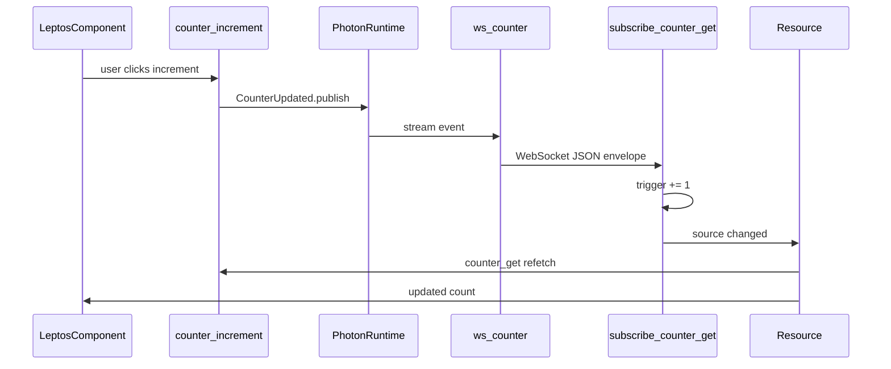

# photon-leptos

[](https://github.com/deathbreakfast/photon-leptos/actions/workflows/ci.yml)

[GitHub](https://github.com/deathbreakfast/photon-leptos) · [photon](https://github.com/deathbreakfast/photon) · `cargo doc -p photon-leptos --features ssr,hydrate --open`

Leptos + Axum WebSocket integration for **browser clients** consuming [Photon](https://github.com/deathbreakfast/photon) topics. This repo is Zone C — product integration built on the core pub/sub library, not a replacement for it.

```rust
use leptos::prelude::*;
use photon::{configure, topic, EmbeddedBackend, Photon, TransportStore};
use photon_leptos::synced;

// 1. Topic (Zone A — photon crate)
#[topic(name = "counter.updated")]
pub struct CounterUpdated {
    pub new_value: u64,
}

// 2. Server fn + macro (Zone C)
#[synced(
    topic = "counter.updated",
    ws = "/ws/counter",
    strategy = "refetch",
    auth = "none",
)]
pub async fn counter_get() -> Result<CounterResponse, ServerFnError> {
    Ok(CounterResponse { value: load_count().await? })
}

pub async fn counter_increment() -> Result<(), ServerFnError> {
    let new_value = mutate_and_save().await?;
    CounterUpdated { new_value }.publish().await?;
    Ok(())
}

// 3. Client — generated subscribe_counter_get bumps a trigger on each WS event
#[component]
fn LiveCounter() -> impl IntoView {
    let trigger = subscribe_counter_get(|| {});
    let count = Resource::new(move || trigger.get(), move |_| counter_get());
    view! { <p>{move || count.get().and_then(|r| r.ok()).map(|c| c.value)}</p> }
}

// 4. Host wiring (integrator — once at boot)
// app = photon_axum::ws_router::<AppState, HeadlessWsAuth>(app);
```

## About photon-leptos

photon-leptos bridges Photon pub/sub events to Leptos UIs over WebSockets. You define topics and publish from server functions with **photon**; you annotate read server functions with **`#[photon_leptos::synced]`** to get client subscription helpers and automatic WS route registration; you merge **`photon_axum::ws_router`** once at host boot.

Core **photon** deliberately has no browser client wiring — `#[photon::synced]` compile-errors there by design.

## The model



- **Topic** — typed event on a named stream (`#[photon::topic]` in the photon crate)
- **Publish** — server function mutates state, then `.publish()` after commit
- **Synced read** — `#[photon_leptos::synced]` generates `subscribe_<fn>` + WS inventory entry
- **Client refetch** — trigger signal wired into a Leptos `Resource`
- **Host** — `ws_router` discovers inventory routes and mounts Axum WS handlers

## Crates

| Crate | Role | Docs |
|-------|------|------|
| `photon-leptos` | Client hooks, `synced` re-export, server re-exports | `cargo doc -p photon-leptos --features ssr,hydrate --open` |
| `photon-axum` | Axum WS routes, quark auto-discovery, `synced_ws_handler` | `cargo doc -p photon-axum --features ssr --open` |
| `photon-leptos-macros` | Proc macro `#[photon_leptos::synced]` | `cargo doc -p photon-leptos-macros --open` |

Zone A keeps `#[photon::topic]` and `#[photon::subscribe]`.

## Who reads what

| Audience | Start here |
|----------|------------|
| App author (topics + UI) | Hero above · [`synced`](photon-leptos-macros/src/lib.rs) · `subscribe_*` hooks |
| Host integrator (Axum boot) | [`photon-axum/README.md`](photon-axum/README.md) · `ws_router` · `HasPhoton` |
| Maintainer | [`photon-leptos/DESIGN.md`](photon-leptos/DESIGN.md) · [`.sentrux/rules.toml`](.sentrux/rules.toml) |

## Getting started

Clone sibling repos for local dev:

```bash
git clone https://github.com/deathbreakfast/photon.git ../photon
git clone https://github.com/deathbreakfast/photon-leptos.git
```

Downstream apps depend via git with optional `[patch]`:

```toml
[dependencies]
photon = { git = "https://github.com/deathbreakfast/photon.git", features = ["ssr", "mem"] }
photon-leptos = { git = "https://github.com/deathbreakfast/photon-leptos.git", features = ["hydrate", "ssr"] }
photon-axum = { git = "https://github.com/deathbreakfast/photon-leptos.git", features = ["ssr"] }

[patch."https://github.com/deathbreakfast/photon-leptos.git"]
photon-leptos = { path = "../photon-leptos/photon-leptos" }
photon-axum = { path = "../photon-leptos/photon-axum" }
photon-leptos-macros = { path = "../photon-leptos/photon-leptos-macros" }
```

**Features:**

- `photon-leptos/hydrate` — client WebSocket subscription helpers (enable on WASM/client builds)
- `photon-leptos/ssr` — server WS route registration via `photon-axum`
- `photon-axum/ssr` — Axum WS handler crate (required for `ws_router`)

Photon boot (Continuum + `PhotonBuilder`) lives in the [photon README](https://github.com/deathbreakfast/photon/blob/main/README.md#getting-started).

## Compared to core photon

**photon** is a headless pub/sub library — no Leptos, no Axum WS, no browser clients. **photon-leptos** is the integration layer for realtime UI. The Unified Field template's counter-app is a full product example; template migration to this repo is deferred (see `WEB_APP_TEMPLATE_MIGRATION.md` in the photon repo).

## FAQ

**Why does `#[photon::synced]` fail to compile?** Zone A intentionally compile-errors that macro. Use `#[photon_leptos::synced]` from this repo (re-exported as `photon_leptos::synced`).

**How does `auth = "user"` work?** The macro registers a user-scoped route. Your host passes a concrete auth type at `ws_router::<AppState, YourAuth>` that implements `PhotonUserExtractor` and `FromRequestParts<S>` — not hardcoded to any product auth crate.

**Why is my WS route missing?** Both conditions are required: (1) a crate linked into the binary uses `#[photon_leptos::synced]` (inventory submit), and (2) boot calls `photon_axum::ws_router` (or `photon_leptos::server::ws_router`).

**SSR vs hydrate?** On SSR-only builds, `subscribe_*` compiles out the WebSocket connection; the trigger stays at 0 and the initial value comes from the `Resource` alone.

## E2E (planned)

Browser integration tests are specified in [e2e/README.md](e2e/README.md). Implementation tracked separately — not part of the Zone C library crate surface.

## Verify

CI runs on every push and PR ([`.github/workflows/ci.yml`](.github/workflows/ci.yml)):

```bash
cargo clippy --workspace --all-targets --features ssr -- -D warnings
cargo test -p photon-axum -p photon-leptos -p photon-leptos-macros --features ssr
cargo doc -p photon-leptos -p photon-axum -p photon-leptos-macros --features ssr,hydrate --no-deps
```

Local dev requires `../photon` checked out (workspace path deps).
