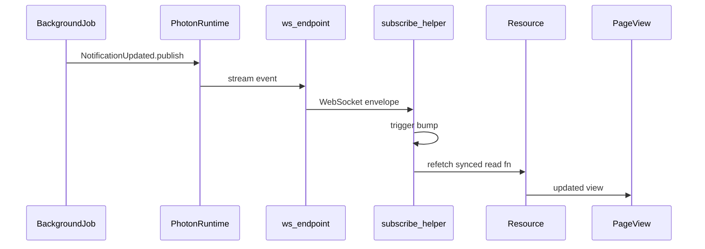

# photon-leptos

[](https://github.com/deathbreakfast/photon-leptos/actions/workflows/ci.yml)

[GitHub](https://github.com/deathbreakfast/photon-leptos) · [photon](https://github.com/deathbreakfast/photon) · `cargo doc -p photon-leptos --features ssr,hydrate --open`

Leptos + Axum integration built on [photon](https://github.com/deathbreakfast/photon) — browser clients subscribe to topics over WebSockets and refetch synced server functions when events arrive.

```rust
use leptos::prelude::*;
use photon::{topic, /* ... */};
use photon_leptos::synced;

#[topic(name = "notifications.updated")]
pub struct NotificationUpdated { /* ... */ }

#[synced(
    topic = "notifications.updated",
    ws = "/ws/notifications",
    strategy = "refetch",
    auth = "none",
)]
pub async fn list_notifications() -> Result<Vec<Notification>, ServerFnError> { /* ... */ }

// Somewhere else on the server — not the viewing client's click:
async fn on_import_job_finished(...) {
    NotificationUpdated { /* ... */ }.publish().await?;
}

// In the Leptos page (any number of viewers):
let trigger = subscribe_list_notifications(|| {});
let items = Resource::new(move || trigger.get(), move |_| list_notifications());
```

Publish can come from any server path (background job, webhook handler, another user's write)—subscribers only need the topic and synced read fn.

## About photon-leptos

photon-leptos bridges Photon pub/sub events to Leptos UIs over WebSockets. You define topics and publish from server code with **photon**; you annotate read server functions with **`#[photon_leptos::synced]`** to get client subscription helpers and automatic WS route registration; you merge **`photon_axum::ws_router`** once at host boot.

`#[photon::topic]` and `#[photon::subscribe]` live in the **photon** crate. Core **photon** deliberately has no browser client wiring — `#[photon::synced]` compile-errors there by design.

## The model



Client-initiated writes can also publish the same topic; the diagram highlights the decoupled case where the event source is unrelated to the viewing client.

- **Topic** — typed event on a named stream (`#[photon::topic]` in the photon crate)
- **Publish** — any server path mutates state, then `.publish()` after commit
- **Synced read** — `#[photon_leptos::synced]` generates `subscribe_<fn>` + WS inventory entry
- **Client refetch** — trigger signal wired into a Leptos `Resource`
- **Host** — `ws_router` discovers inventory routes and mounts Axum WS handlers

## Crates

| Crate | Role | Docs |
|-------|------|------|
| `photon-leptos` | Client hooks, `synced` re-export, server re-exports | `cargo doc -p photon-leptos --features ssr,hydrate --open` |
| `photon-axum` | Axum WS routes, inventory auto-discovery, `synced_ws_handler` | `cargo doc -p photon-axum --features ssr --open` |
| `photon-leptos-macros` | Proc macro `#[photon_leptos::synced]` | `cargo doc -p photon-leptos-macros --open` |

## Documentation

- **Architecture and API** — `cargo doc -p photon-leptos --features ssr,hydrate --open` (primary reference)
- **Axum boot** — [`photon-axum/README.md`](photon-axum/README.md) · `ws_router` · `HasPhoton` on your app state
- **Macro reference** — `cargo doc -p photon-leptos-macros --open`
- **Roadmap** — [`ROADMAP.md`](ROADMAP.md)

## Getting started

Clone sibling repos for local dev:

```bash
git clone https://github.com/deathbreakfast/photon.git ../photon
git clone https://github.com/deathbreakfast/photon-leptos.git
```

Downstream apps depend via git with optional `[patch]`:

```toml
[dependencies]
photon = { git = "https://github.com/deathbreakfast/photon.git", features = ["ssr", "mem"] }
photon-leptos = { git = "https://github.com/deathbreakfast/photon-leptos.git", features = ["hydrate", "ssr"] }
photon-axum = { git = "https://github.com/deathbreakfast/photon-leptos.git", features = ["ssr"] }

[patch."https://github.com/deathbreakfast/photon-leptos.git"]
photon-leptos = { path = "../photon-leptos/photon-leptos" }
photon-axum = { path = "../photon-leptos/photon-axum" }
photon-leptos-macros = { path = "../photon-leptos/photon-leptos-macros" }
```

**Features:**

- `photon-leptos/hydrate` — client WebSocket subscription helpers (enable on WASM/client builds)
- `photon-leptos/ssr` — server WS route registration via `photon-axum`
- `photon-axum/ssr` — Axum WS handler crate (required for `ws_router`)

Photon boot (Continuum + `PhotonBuilder`) lives in the [photon README](https://github.com/deathbreakfast/photon/blob/main/README.md#getting-started).

## Compared to core photon

**photon** is a headless pub/sub library — no Leptos, no Axum WS, no browser clients. **photon-leptos** is the integration layer for realtime UI.

## FAQ

**Why does `#[photon::synced]` fail to compile?** The **photon** crate compile-errors that macro by design. Use `#[photon_leptos::synced]` from this repo (re-exported as `photon_leptos::synced`).

**How does `auth = "user"` work?** The macro registers a user-scoped route. Your host passes a concrete auth type at `ws_router::<AppState, YourAuth>` that implements `PhotonUserExtractor` and `FromRequestParts<S>`.

**Why is my WS route missing?** Both conditions are required: (1) a crate linked into the binary uses `#[photon_leptos::synced]` (inventory submit), and (2) boot calls `photon_axum::ws_router` (or `photon_leptos::server::ws_router`).

**SSR vs hydrate?** On SSR-only builds, `subscribe_*` compiles out the WebSocket connection; the trigger stays at 0 and the initial value comes from the `Resource` alone.

## E2E

A self-contained counter demo and Playwright harness live under [`e2e/`](e2e/README.md). Run browser tests from the workspace root:

```bash
cd e2e/tests && npm ci && npx playwright install --with-deps
cargo leptos end-to-end --project photon-leptos-e2e
```

The demo is not part of the library crate API. CI runs browser E2E on every push and PR (chromium, firefox, webkit) via the `e2e` job in [`.github/workflows/ci.yml`](.github/workflows/ci.yml).

## Verify

CI runs on every push and PR ([`.github/workflows/ci.yml`](.github/workflows/ci.yml)):

```bash
cargo clippy --workspace --all-targets --features ssr -- -D warnings
cargo test -p photon-axum -p photon-leptos -p photon-leptos-macros --features ssr
cargo doc -p photon-leptos -p photon-axum -p photon-leptos-macros --features ssr,hydrate --no-deps
```

Local dev requires `../photon` checked out (workspace path deps).
