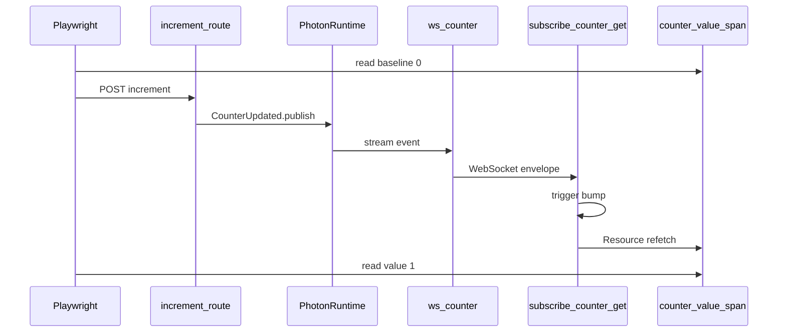

# photon-leptos E2E (planned)

**Status:** specification only — the demo app, trigger route, and Playwright harness do **not** exist yet. Implementation is tracked in [`ROADMAP.md`](../ROADMAP.md).

## Goal

Prove **publish → WebSocket → Leptos refetch** with a self-contained demo under this directory. No external app repos or templates required.

## Layout (future)

```
e2e/
  README.md       # this spec
  demo/           # minimal Leptos + Axum app (workspace member when added)
  tests/          # Playwright specs
```

All demo code — synced read fns, topic, WS routes, and the increment trigger route — lives under `e2e/demo/`. Nothing in `photon-leptos`, `photon-axum`, or `photon-leptos-macros` gains test-only routes.

## Why counter here (not in the public README)

| Concern | README / rustdoc | E2E (`e2e/demo/`) |
|---------|------------------|-------------------|
| Teach the library | Generic domain, server-job publish | Minimal toy domain |
| Prove behavior in CI | Unit/integration tests | Browser: read value → HTTP trigger → WS → UI update |
| Trigger | Decoupled (job, webhook, etc.) | Test-only Axum route in the demo app — not on the Leptos page |

## UI: one value, no CSS

The Leptos page is a single synced read surface — nothing to click:

| Element | Role | Suggested hook |
|---------|------|----------------|
| Counter display | Shows current value from synced `Resource` | `data-testid="counter-value"` or `#counter-value` (e.g. `<span>`) |

- **No CSS** — no stylesheets, no component library, no layout chrome.
- **One visible value** on the page; no buttons, forms, or nav in v1.

## Demo server (future `e2e/demo/`)

| Piece | Description |
|-------|-------------|
| Photon boot | Headless mem backend — same pattern as [photon Getting started](https://github.com/deathbreakfast/photon#getting-started) |
| App state | `HasPhoton` + `Arc<Photon>` on Axum state |
| Router | `photon_axum::ws_router::<AppState, HeadlessWsAuth>(app)` |
| Topic | `#[photon::topic(name = "counter.updated")]` on `CounterUpdated` |
| Read fn | `counter_get` with `#[photon_leptos::synced(topic = "counter.updated", ws = "/ws/counter", auth = "none")]` |
| Client | `subscribe_counter_get(|| {})` + `Resource::new` refetching `counter_get` |
| Publish trigger | Plain Axum handler in the demo router (e.g. `POST /api/counter/increment`) — mutates shared in-memory state and calls `CounterUpdated.publish()`. Playwright calls it via `request.post(...)`; the page never invokes it. |

No `cfg` / Cargo feature required: the trigger route is demo-app code under `e2e/` and is never shipped with the library crates.



## Happy-path E2E (Playwright, future)

1. Open page; read baseline from `#counter-value` (expect `0`).
2. `POST` the demo increment route (path TBD when demo is implemented).
3. Short wait; WebSocket → trigger bump → Resource refetch.
4. Read `#counter-value` again (expect `1`).
5. Optional: second browser tab updates without calling the route again.

Run via `cargo leptos end-to-end` once the demo exists (benchmark + E2E only — not a default dev or release surface).

## Sad-path E2E (future)

| Scenario | Setup | Expected client behavior |
|----------|-------|--------------------------|
| Server fn error | `counter_get` returns `Err` | UI shows error state; no panic; `Resource` exposes failure |
| Publish failure | inject failing publish in increment handler | count unchanged |
| WS unavailable | omit `ws_router` or block `/ws/counter` | trigger stays 0; initial SSR value remains |
| WS disconnect mid-session | force-close socket after connect | client reconnect/backoff; count recovers on next publish |
| Auth=user mismatch | `HeadlessWsAuth` on route registered with `auth = "user"` | client receives no events when publish uses keyed partition |

## CI integration (future)

- New workflow job `e2e`, initially `workflow_dispatch` only
- Checkout sibling `photon` repo (same as library CI)
- Run `cargo leptos end-to-end` against `e2e/demo/` once it exists
- Playwright under `e2e/tests/`

## Out of scope for library crates

The demo app and browser tests are **not** part of `photon-leptos`, `photon-axum`, or `photon-leptos-macros` public API. Keep them in this `e2e/` tree.
