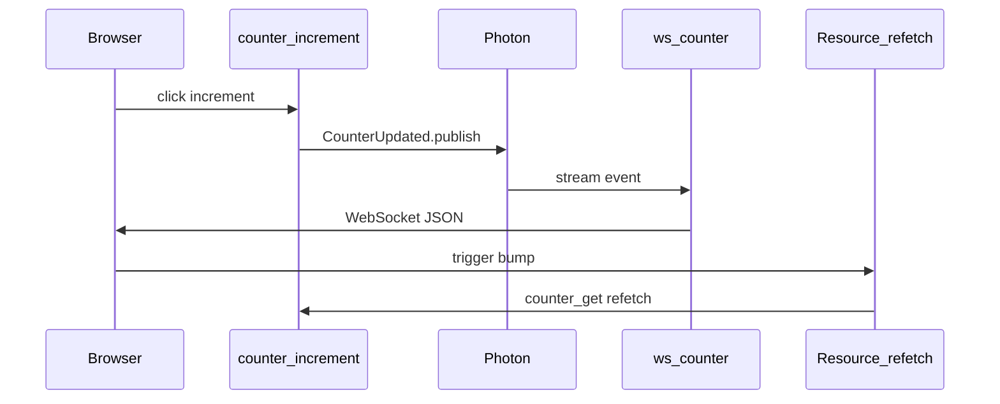

# photon-leptos E2E (planned)

**Status:** specification only — no demo app or Playwright harness yet.

## Goal

Prove **publish → WebSocket → Leptos refetch** without the full web-app-template stack. This validates the Zone C integration path in isolation.

## Future layout

```
e2e/
  README.md                 # this spec
  photon-leptos-demo/         # TODO — minimal cargo-leptos app
  end2end/                    # TODO — Playwright specs
```

## Minimal demo app (`photon-leptos-demo`, future)

| Piece | Description |
|-------|-------------|
| Photon boot | Headless mem backend — same pattern as [photon Getting started](https://github.com/deathbreakfast/photon#getting-started) |
| App state | `HasPhoton` + `Arc<Photon>` on Axum state |
| Router | `photon_axum::ws_router::<AppState, HeadlessWsAuth>(app)` |
| UI | Single Leptos page: counter display + increment button |
| Topic | `#[photon::topic(name = "counter.updated")]` on `CounterUpdated` |
| Read fn | `counter_get` with `#[photon_leptos::synced(topic = "counter.updated", ws = "/ws/counter", auth = "none")]` |
| Write fn | `counter_increment` mutates in-memory counter, then `CounterUpdated.publish().await?` |
| Client | `subscribe_counter_get(|| {})` + `Resource::new` refetching `counter_get` |



## Happy-path E2E (Playwright, future)

1. Load page — initial count visible (SSR and after hydrate)
2. Click increment — count updates without full page reload
3. Optional: assert WebSocket connection via test-only status element or network hook

## Sad-path E2E (future — required)

| Scenario | Setup | Expected client behavior |
|----------|-------|--------------------------|
| Server fn error | `counter_get` returns `Err` | UI shows error state; no panic; `Resource` exposes failure |
| Publish failure | inject failing publish in `counter_increment` | increment shows error; count unchanged |
| WS unavailable | omit `ws_router` or block `/ws/counter` | trigger stays 0; initial SSR value remains; optional offline indicator |
| WS disconnect mid-session | force-close socket after connect | client reconnect/backoff; count recovers on next publish |
| Auth=user mismatch | `HeadlessWsAuth` on route registered with `auth = "user"` | client receives no events when publish uses keyed partition |

## CI integration (future)

- New workflow job `e2e`, initially `workflow_dispatch` only (lean PR CI — see Orbital pattern)
- Checkout sibling `photon` repo (same as library CI)
- Run `cargo leptos end-to-end` against `photon-leptos-demo` once it exists
- Playwright under `e2e/end2end/` mirroring Orbital `end2end/tests/`

## Out of scope for library crates

The demo app and browser tests are **not** part of `photon-leptos`, `photon-axum`, or `photon-leptos-macros` public API. Keep them in this `e2e/` tree when implemented.
